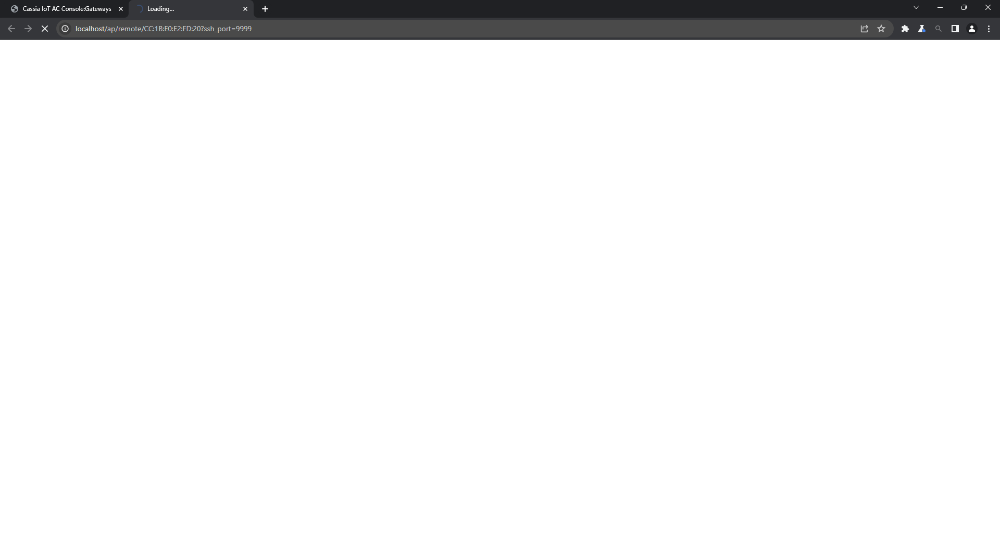
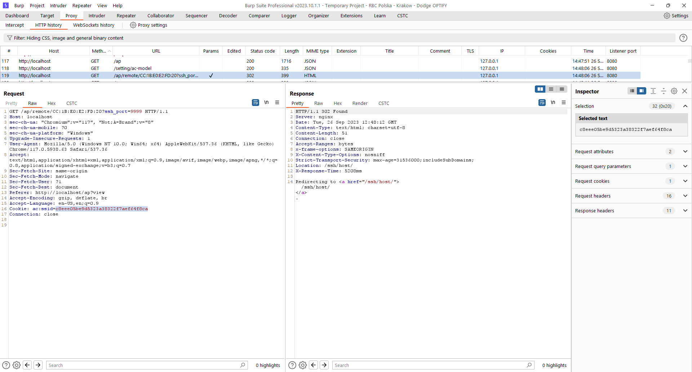
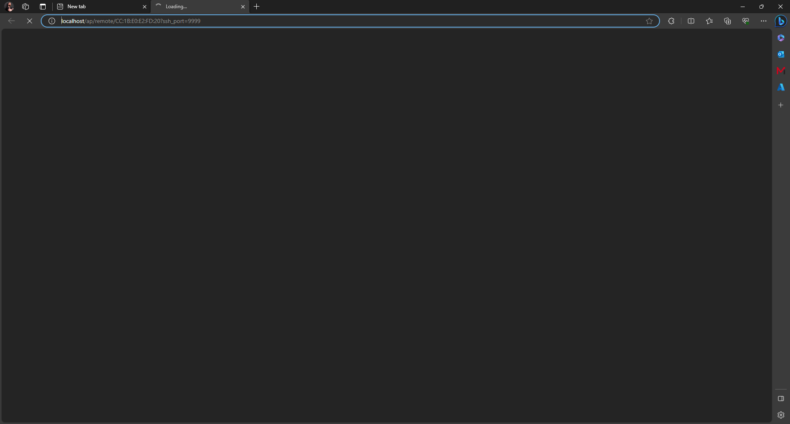
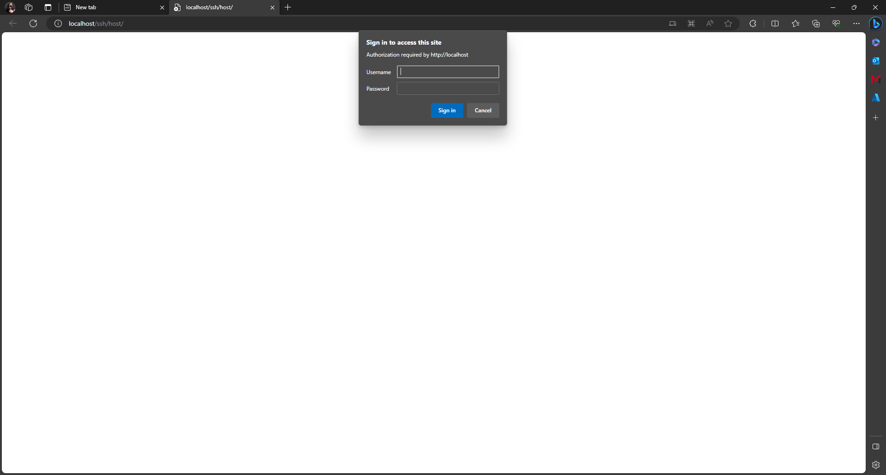

# CVE-2023-35793-CSRF-On-Web-SSH
Repository contains description for CVE-2023-35793 discovered by Dodge Industrial Team for Dodge OPTIFY platfrom.
___  
CVE ID: CVE-2023-35793  
Vendor: Cassia Networks  
Product: Access Controller  
Version: Cassia-AC-2.1.1.2303271039  
___
Vulnerability: Cross Site Request Forgery (CSRF)  
Affected: web ssh, gateways  
Decription: WebSSH functionality can be intialized by CSRF.  
Status: Confirmed by vendor, Fixed  
Version Patched: Cassia-AC-2.1.1.2308181707
____
#### Details
Cassia uses WebSSH2 by billchurch to initiate SSH sessions from AC to Gateways. WebSSH2 Is a web SSH Client which uses ssh2, socket.io, xterm.js, and express. 
A bare bones example of an HTML5 web-based terminal emulator and SSH client. It uses SSH2 as a client on a host to proxy a Websocket/Socket.io connection to a SSH2 server.

When a user is logged into AC it uses _ac:ssid_ cookie with Same Site Strict cookie. 


To Initiate SSH Web session with gateway users send GET request with mac and port number (reverse ssh) without CSRF token used.
```
http://<ac-ip>/ap/remote/<mac-addr>?ssh_port=9999
```




An attacker may trick user by sending him link address. 
This will trigger SSH session establishment by user (further it reveals that user can be just read-only).

____
#### Exploitation

Attacker may trick already authenticated user to click link provided in teams chat or email what will result in establishing conncetion to provided device.

1) User admin is doing some activities on AC:


2) Attacker knows admin email sends SE profiled message (or post it on ITSM ticket) embedding URL. Admin then may click on link while his browser will
start session (note session is persistent - even when user close browser, the session will run already):


3) Session starts as there is no CSRF Token on other protection used!
_AC sends request to Gateway with provided MAC address to establish reverse SSH
to AC - the attacker may use local port forwading (used in solution) to remotely
bruteforce SSH access (can be easy when default passwords are used)



#### Remediation
- Patch to the highest possible version availaible on [Cassia Networks](https://www.cassianetworks.com/)
